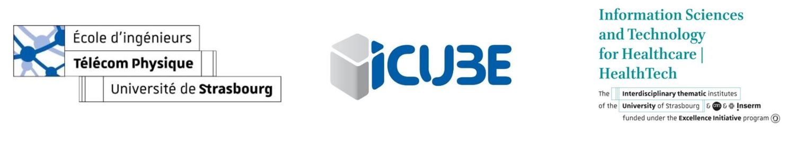

<!-- Improved compatibility of back to top link: See: https://github.com/othneildrew/Best-README-Template/pull/73 -->

<!-- PROJECT LOGO -->
 

  

  <h1 align="center">Smart ultrasound device for non-invasive real-time 
myocardial stiffness quantification of the human heart - Poster Presentation</h1>

  

    <a href="https://github.com/Habeeb-Yusuff?tab=repositories"><strong>View all repositories  »</strong></a>
     
     
  

<!-- TABLE OF CONTENTS -->

  
Table of Contents

  <ol>
    <li>
      <a href="#about-the-project">About The Project</a>
  </ol>

<!-- ABOUT THE PROJECT -->
## About The Project

This is a poster presentation on a reviewed article titled "Smart ultrasound device for non-invasive real-time myocardial stiffness quantification of the human heart". This was done as part of my master's course work.

## CAD Assembly

    

<!-- CONTACT -->
## Contact

Habeeb Yusuff - [Linkedin - habeeb-yusuff](https://linkedin.com/in/habeeb-yusuff-347736176/) - Yusuffdayohabeeb@gmail.com

(<a href="#readme-top">back to top</a>)

